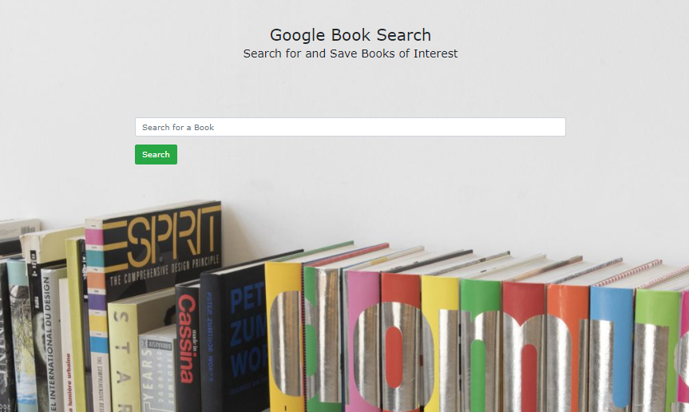
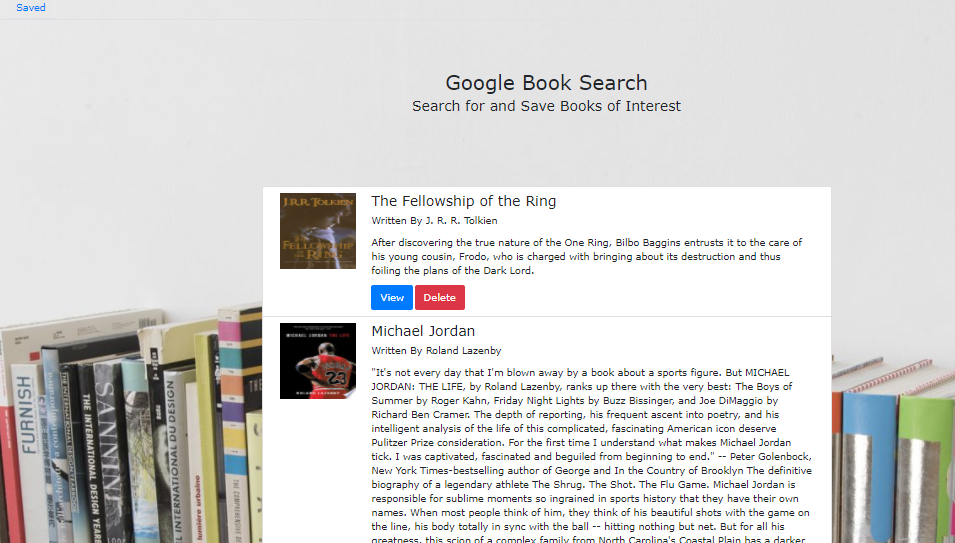

## Google book search

# Functionality
This react application will allow for you to search for Books through a google books API. Through the search function you will be displayed a whole list of books that you have the option to save and add to your list which utilizes MongoDB. You will also be able to edit your saved book by removing specific books from your saved list.

Libraries/Frameworks used:
1. React
2. Bootstrap
3. Express
4. Mongoose
5. React-Bootstrap
6. React-Router

Database Used:
1. MongoDB

Npm Packages Used:
1. Axios

# Author Shoutout

Pieter Boerma

Thanks to my coding friends and tutor for their patience and helping me pull this together

